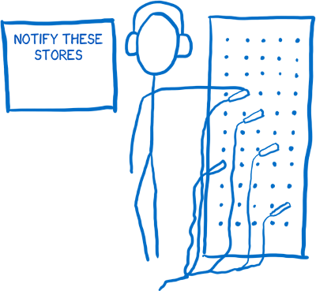
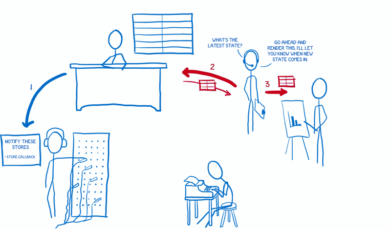
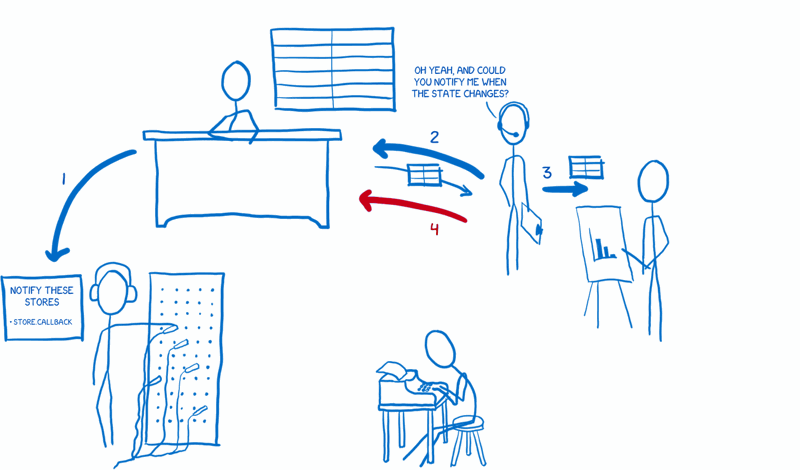
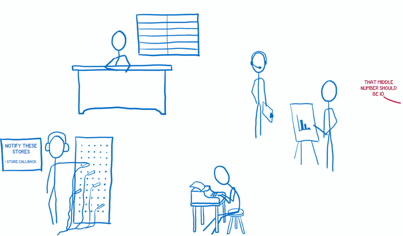
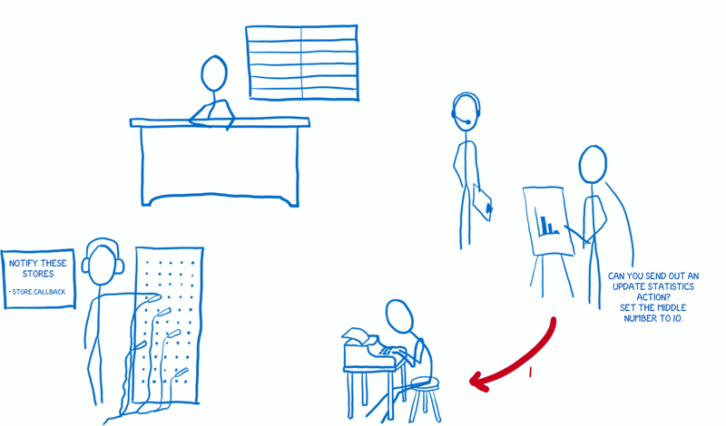
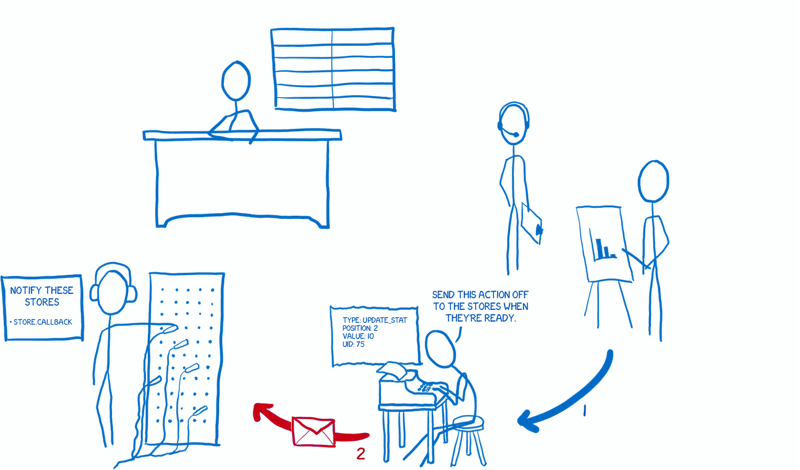
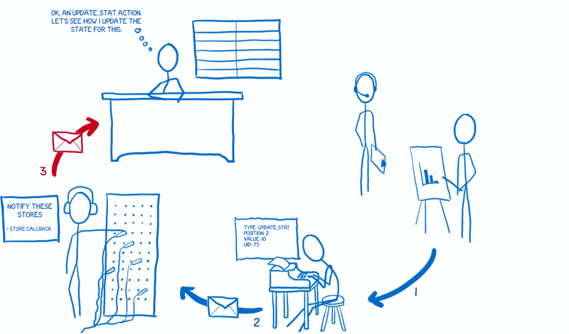
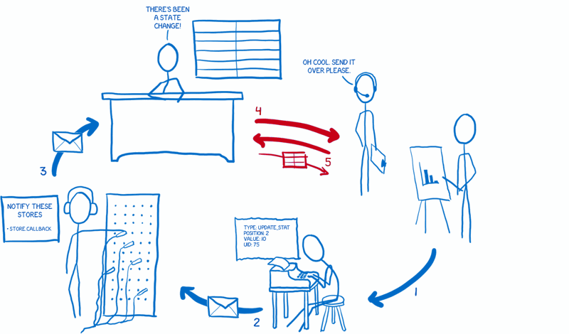
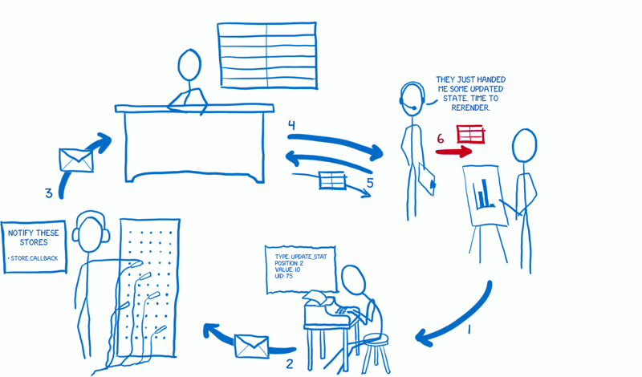

*Bài viết được dịch từ [A cartoon guide to Flux của tác giả Lin Clark](https://code-cartoons.com/a-cartoon-guide-to-flux-6157355ab207)*

---

Flux là một trong những chủ đề nóng hổi cũng như khó hiểu trong phát triển web hiện tại.
Bài viết này sẽ cố gắng để giải thích Flux theo cách đơn giản nhất.

## Vấn đề

Đầu tiên, mình sẽ giải thích vấn đề mà Flux sinh ra để giải quyết. Flux là một mô hình để xử lí dữ liệu trong ứng dụng của bạn. Flux và React cùng được phát triển tại Facebook. Nhiều lập trình viên thường dùng chúng chung với nhau nhưng các bạn có thể dùng chúng riêng lẻ. Flux và React được phát triển để giải quyết một số vấn đề mà Facebook gặp phải.

Trong số những vấn đề đó thì điển hình nhất là lỗi của thanh thông báo. Bạn đăng nhập vào Facebook, bạn sẽ thấy thông báo trên biểu tượng chat.

Kì lạ thay, bạn nhấn vào biểu tượng chat thì không có tin nhắn nào cả. Sau khi lướt news feed vài phút thì thông báo xuất hiện lại. Bạn nhấn vào biểu tượng chat lần nữa ... vẫn không có bất kì tin nhắn nào. Vấn đề này cứ tiếp diễn thành một vòng lặp.

Vấn đề nêu trên khi chỉ là vòng lặp cho người dùng mà nó cũng là vòng lặp cho các kĩ sư Facebook. Họ sửa bug này, mọi thứ hoạt động bình thường rồi lỗi này lại xuất hiện. Các kĩ sư tiếp tục sửa lỗi, rồi nó cứ xuất hiện trở lại.

## Vấn đề cốt lõi

Vấn đề cốt lõi được các kĩ sư xác định là do cách mà dữ liệu di chuyển trong ứng dụng.

*Model truyền dữ liệu với View*

Họ có model để lưu dữ liệu, sau đó truyền dữ liệu đến view để render. Bởi vì người dùng tương tác thông qua view, nên view cần phải cập nhật model dựa trên tương tác của người dùng. Model thì nhiều khi lại cần cập nhất model khác.

Thêm vào đó, nhiều khi một thay đổi sẽ kích hoạt dây chuyền các thay đổi khác trong model. Hãy tưởng tượng nhưng bạn chơi trò Pong, bạn sẽ không thể nào biết được quả bóng sẽ chạm vào đâu (hoặc là rơi ra khỏi màn hình).

*View cập nhật model. Model cập nhật model khác. Nó giống như quả bóng khi chơi Pong*

Bỏ qua sự thật hiển nhên là những thay đổi này có thể xảy ra không đồng bộ (async). Một thay đổi có thể kích hoạt nhiều thay đổi khác. Tưởng tượng việc nào giống như đổ hẳn một túi bóng vào màn hình trong trò Pong. Các quả bóng này sẽ chạy tự tung loạn xạ.

Tóm lại thì mô hình trên làm cho việc debug luồng đi của dữ liệu trở nên khó khăn.

## Giải pháp: luồng dữ liệu một chiều

Vì các lí do đã giải thích ở trên, Facebook đã thử nghiệm một mô hình, mà dữ liệu di chuyển theo một chiều - chỉ một chiều - và khi bạn cần thêm dữ liệu mới vào, các luồng này bắt đầu tại điểm xuất phát. Họ gọi nó là mô hình Flux.

*Sơ đồ từ tài liệu về Flux của Facebook. Nó tuyệt vời hơn bạn tường*

Flux thực sự rất tuyệt vời ... nhưng bạn không thể biết chỉ bằng việc nhìn vào sơ đồ trên.

Một khi bạn đã hiểu Flux, sơ đồ trên trở nên rất rõ ràng. Vấn đề là khi bạn tìm hiểu về Flux thông qua tài liệu chính thức, mình không nghĩ là sơ đồ trên sẽ giúp bạn hiểu về nó. Nhiệm vụ của một sơ đồ là cho bạn cái nhìn toàn cảnh về hệ thống trước khi bắt đầu nghiên cứu sâu về nó.

Mình hiểu về Flux không phải nhờ sơ đồ kiểu này, mà là suy nghĩ về hệ thống thông qua các nhân vật cùng làm việc để đạt được mục tiêu. Hôm nay, mình sẽ giới thiệu với các bạn phần diễn xuất của các nhân vật do mình tự nghĩ ra.

## Giới thiệu nhân vật

Mình sẽ giới thiệu nhân về các nhân vật trước khi giải thích sự tương tác giữa các nhân vật này.

### Action creator (người tạo hành động)

> Lưu ý: Trong bài này mình sẽ không dịch các thuật ngữ liên quan trực tiếp đến Flux.

Nhân vật đầu tiên chính là action creator. Nó có nhiệm vụ tại hành động. Hành động là cách thức mà mọi thay đổi và tương tác xảy ra. Mỗi khi bạn muốn thay đổi trạng thái app hay render một view khác hoàn toàn, bạn sẽ tạo ra một hành động.

Mình ví action creator như là một nhân viên tiếp tân của tổng đài điện thoại. Bạn gửi những thông tin bạn cần truyền đi đến action creator, sau đó action creator sẽ định dạng thông tin theo cách mà toàn bộ hệ thống có thể hiểu được.

Action creator tạo ra một hành động với một kiểu hành động (action's type) và nội dung hành động (action's payload). Mỗi kiểu hành động sẽ là một trong những kiểu hành động bạn đã định nghĩa sẵn trong hệ thống (thường là một danh sách các hằng - constant). `MESSAGE_CREATE` và `MESSAGE_READ` là các ví dụ cụ thể của hành động.

Một hiệu ứng tuyệt vời khi mà hệ thống của bạn biết được tất cả các hành động có thể xảy ra, đó là một lập trình viến mới tiếp cận với dự án, mở file định nghĩa action creator và có thể xem được toàn bộ API, biết đường được toàn bộ các thay đổi có thể xảy ra trong hệ thống cùa bạn.

Một khi action creator tạo ra một hành động, nó sẽ truyền hành động này tới dispatcher.

### Dispatcher (người truyền tin)

Về cơ bản, dispatcher là một danh bạ callback lớn. Nó như là một nhân viên tổng đài điện thoại làm việc ở bảng điều khiển. Nó sẽ giữ một dành sách lớn các store cần nhận hành động. Mỗi khi hành động đến từ action creator, nó sẽ truyền hành động này đến các store khác nhau.

Dispatcher thực hiện việc truyền tin của mình một cách đồng bộ. Việc này giúp giải quyết vấn để nhiều quả bóng cùng lúc trong trò Pong mà mình đã nói ở trên. Bạn có thể thiết lập để một store nhận cập nhật trước một store khác thông qua `waitFor()`.

Người truyền tin của Flux khác với người truyền tin trong các mô mình khác. Hành động sẽ được truyền tới tất cả các store đã được đăng kí với người truyền tin mà không phân biệt kiểu hành động. Hay nói cách khác, các store không chỉ lắng nghe (subscribe) các hành cụ thể mà chúng sẽ lắng nghe tất cả các hành động rồi lọc ra các hành động mà nó quan tâm để tiếp tục xử lí.

### Store

Tiếp theo là store. Store sẽ giữ tất cả các thông tin về trạng thái ứng dụng và tất cả logic để thay đổi trạng thái nằm trong store.

Mình tưởng tượng store là một vị công chức lạm quyền. Mọi thay đổi trạng thái phải được thông qua bởi vị này. Và bạn không thể trực tiếp yêu cầu store thay đổi state, vì store không có setter. Để thực hiện một thay đổi đối với state, bạn chỉ có thể thực hiện bằng một phương thức duy nhất đó là thông qua action creator và dispatcher.

Nhưng mình đã nói ở trên thì nếu một store được kết nối với dispatcher thì nó sẽ nhận được tất cả mọi hành động. Trong mỗi store thường sẽ có một câu lệnh `switch` để phân loại kiểu hành động. Nếu đây đúng là hành động mà store quan tâm, nó sẽ thực hiện những thay đổi cần thiết và cập nhật state.

Một khi store đã áp dụng các thay đổi cho state, nó sẽ phát ra tín hiệu báo cho controller view về sự thay đổi này.

### Controller view và view

View có trách nhiều nhận thông tin từ state và render giao diện cũng như là nhận lại tương tác của người dùng.

View chỉ là người đại diện, nó không có bất kì ý thức gì về logic của ứng dụng. Nó chỉ nhận dữ liệu, định dạng và xuất ra thành HTML markup.

Controller view đóng vai trò như là một người quản lí trung gian giữa store và view. Store sẽ báo controller view mỗi khi có sự thay đổi từ state. Nó sẽ nhận state mới và truyền tới tất cả các view mà nó quản lí.

## Tương tác giữa các nhân vật

### Thiết lập

Có một bước thiết lập nhỏ để các nhân vật có thể tương tác với nhau. Ứng dụng chỉ cần làm việc này duy nhất vào lúc khởi động.

1. Store sẽ báo cho dispatcher biết nó muốn được thông báo khi có action.

2. Sau đó controller view sẽ hỏi store để nhận state mới nhất
3. Khi controller view nhận được state từ store thì chúng sẽ gửi các state này tới các view chịu sự quản lí của chúng để render.

4. Controller view cũng yêu cầu store thông báo khi state được cập nhật.

### Luồng dữ liệu

Một khi quá trình thiết lập hoàn tất, ứng dụng đã sẵn sàng để nhận tương tác của người dùng. Chúng ta sẽ bắt đầu bằng việc kích hoạt một action thông qua thay đổi từ phía người dùng.

1. Một khi có tương tác của người dùng, view sẽ báo cho action creator chuẩn bị một hành động mới.

2. Action creator định dạng hành động và gửi nó tới dispatcher

3. Dispatcher sẽ gửi hành động này tới các store theo tuần tự. Mỗi store sẽ được thông báo về tất cả các hành động. Sau đó, store sẽ quyết định xem nó có nên xử lí hành động này hay không, nếu có thì cập nhật state cho phù hợp.

4. Khi store đã hoàn thành thay đổi state, nó sẽ báo cho các controller view đã liên kết biết

5. Các controller view sẽ yêu cầu store gửi chúng những cập nhật mới về state.

6. Sau khi đã nhận được state, controller view sẽ báo cho các view do nó quản lí render dựa trên state mới.

Đó là cách mà mình suy nghĩ về Flux. Hy vọng nó giúp ích cho bạn!
